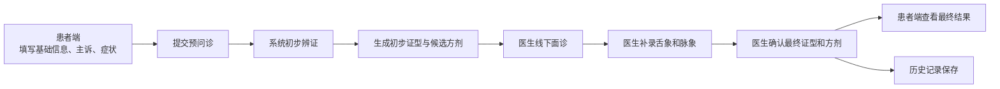
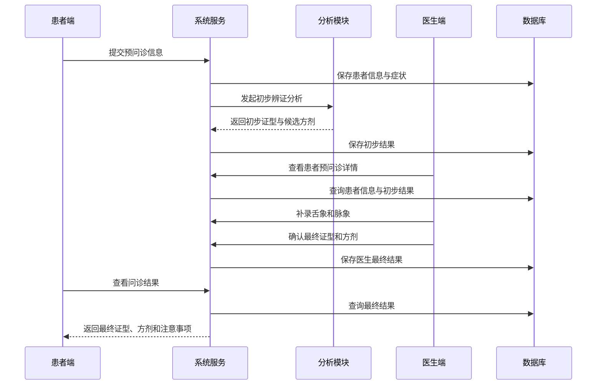

# 基于知识图谱的中医药诊疗智能体业务场景方案

## 一、业务场景定位

本项目更适合定义为一个：

**面向线下门诊场景的线上预问诊辅助系统**

也就是说，系统不是完全替代医生完成线上诊疗，而是让患者先在线上提交基础问诊信息，系统先完成初步分析，医生再在线下门诊结合面诊、舌象、脉象等信息做最终确认。

这种模式比纯线上问诊更符合中医诊疗实际，也更适合项目落地与展示。

## 二、为什么采用“线上 + 线下”模式

### 1. 患者能在线上提供的信息有限

患者通常可以准确填写：

- 基本信息
- 主诉
- 症状表现
- 发病时间
- 生活习惯或其他补充情况

但患者往往不能准确判断：

- 舌象类型
- 脉象类型
- 专业辨证结论

### 2. 中医诊疗依赖面诊和医生经验

中医辨证强调“四诊合参”，尤其是：

- 望诊
- 闻诊
- 问诊
- 切诊

其中 `脉象` 基本需要医生现场判断，因此不适合完全依赖患者线上填写。

### 3. 更符合真实应用场景

本项目最合理的落地方式是：

- 患者线上提前提交信息
- 医生线下面诊时快速查看问诊内容
- 系统辅助医生完成辨证和方剂推荐
- 医生给出最终诊断结论

这样既体现了智能辅助价值，也保留了医生的专业主导地位。

## 三、系统整体业务模式

系统采用“两阶段问诊”模式：

### 第一阶段：线上预问诊

由患者在手机端或小程序中提前填写基础信息和症状。

主要目的：

- 提前采集患者信息
- 减少门诊现场重复沟通
- 为系统初步辨证提供输入数据

### 第二阶段：线下面诊确认

由医生在线下门诊中查看患者提交内容，并结合实际面诊结果补充专业信息。

主要目的：

- 补录舌象和脉象
- 结合经验修正系统结果
- 确认最终辨证结论与方剂建议

## 四、必要总流程

本项目完整业务流程可整理为：

`患者线上预问诊 -> 系统初步辨证 -> 医生线下面诊 -> 医生确认/调整结果 -> 患者查看最终结果 -> 历史记录沉淀`

其中核心闭环为：

`信息采集 -> 初步分析 -> 医生确认 -> 结果回传 -> 历史保存`

## 五、角色划分

系统只需要两类核心角色：

### 1. 患者

职责：

- 提交基础信息
- 提交症状信息
- 上传舌照或选择“不清楚”
- 查看最终结果
- 查看历史记录

### 2. 医生

职责：

- 查看患者预问诊信息
- 查看系统初步辨证结果
- 补录舌象与脉象
- 确认或调整辨证结论
- 确认推荐方剂

## 六、功能父子结构

## 6.1 一级功能

1. 患者预问诊
2. 系统初步辨证
3. 医生面诊确认
4. 结果查看
5. 历史记录

## 6.2 二级功能

### 1. 患者预问诊
1.1 填写患者基础信息  
1.2 填写主诉  
1.3 选择症状  
1.4 填写发病时长与补充描述  
1.5 上传舌照或选择“不清楚”  
1.6 提交预问诊  

### 2. 系统初步辨证
2.1 接收患者提交信息  
2.2 对症状进行标准化处理  
2.3 根据规则或知识图谱生成初步证型  
2.4 生成候选方剂  
2.5 输出初步判断依据  

### 3. 医生面诊确认
3.1 查看患者预问诊信息  
3.2 查看系统初步分析结果  
3.3 补录舌象  
3.4 补录脉象  
3.5 确认或调整证型  
3.6 确认或调整方剂  
3.7 填写注意事项  

### 4. 结果查看
4.1 患者查看最终证型  
4.2 患者查看最终方剂建议  
4.3 患者查看注意事项  

### 5. 历史记录
5.1 保存本次问诊信息  
5.2 保存系统初步分析结果  
5.3 保存医生最终确认结果  
5.4 支持历史记录查询  

## 七、页面设计

## 7.1 患者端页面

### 1. 患者首页

功能：

- 发起预问诊
- 查看最近一次结果
- 查看历史记录

### 2. 预问诊页

功能：

- 填写姓名、年龄、性别
- 填写主诉
- 勾选症状
- 填写发病时长
- 填写补充描述
- 上传舌照
- 提交预问诊

说明：

- 患者端不要求填写脉象
- 舌象不要求患者专业判断，只需要上传照片或选择“不清楚”

### 3. 结果页

功能：

- 查看医生确认后的最终证型
- 查看最终推荐方剂
- 查看日常注意事项

### 4. 历史记录页

功能：

- 查看历史问诊记录
- 查看每次问诊详情

## 7.2 医生端页面

### 1. 首页总览

功能：

- 查看待处理预问诊数量
- 查看今日接诊数量
- 进入问诊处理模块

### 2. 预问诊列表页

功能：

- 查看待确认患者列表
- 按状态筛选
- 进入详情页

### 3. 问诊详情页

功能：

- 查看患者基本信息
- 查看主诉与症状
- 查看舌照
- 查看系统初步辨证结果
- 补录舌象
- 补录脉象
- 确认或修改证型
- 确认或修改方剂
- 填写注意事项

### 4. 历史问诊页

功能：

- 查看已完成问诊
- 回看系统初步结果和医生最终结果

## 八、数据字段调整建议

如果采用“线上预问诊 + 线下面诊确认”模式，数据设计建议做如下调整。

### 1. 患者提交信息

患者端应提交：

- 姓名
- 年龄
- 性别
- 主诉
- 症状列表
- 发病时长
- 补充描述
- 舌照图片

### 2. 不要求患者提交的信息

患者端不强制提交：

- 舌象专业判断
- 脉象
- 最终辨证结果

### 3. 医生端补录信息

医生端补录：

- 舌象结论
- 脉象结论
- 最终证型
- 最终方剂
- 注意事项

## 九、推荐的数据状态流转

建议问诊单状态如下：

- `draft`：患者填写中
- `submitted`：患者已提交，待系统分析
- `preliminary_done`：系统已生成初步结果
- `doctor_reviewing`：医生正在查看
- `confirmed`：医生已确认
- `archived`：已归档

## 十、结果区分方式

系统中建议区分两类结果：

### 1. 初步结果

来源：系统自动分析  
用途：给医生提供辅助参考  

包括：

- 初步证型
- 初步推荐方剂
- 初步判断依据

### 2. 最终结果

来源：医生确认  
用途：返回患者端展示并用于历史沉淀  

包括：

- 最终证型
- 最终方剂
- 最终注意事项

## 十一、数据流图

## 十二、时序图

## 十三、一个可直接使用的示例场景

### 1. 患者线上提交

- 姓名：张三
- 年龄：25
- 性别：男
- 主诉：咽痛、发热两天
- 症状：发热、咽痛、口干
- 发病时长：2 天
- 补充描述：偶有咳嗽
- 舌照：已上传

### 2. 系统初步分析

- 初步证型：风热犯肺
- 初步方剂：银翘散
- 判断依据：发热、咽痛、口干，符合风热表现

### 3. 医生线下面诊确认

- 查看患者舌照
- 现场判断舌红、苔黄
- 现场切脉判断脉浮数
- 最终确认证型：风热犯肺
- 最终确认方剂：银翘散
- 补充注意事项：清淡饮食，多饮水，必要时复诊

### 4. 患者查看结果

患者端展示：

- 最终证型
- 推荐方剂
- 注意事项
- 问诊时间

## 十四、结论

本项目最适合的正式业务定义是：

**患者线上完成预问诊，医生在线下门诊完成专业确认，系统在两者之间提供智能辨证与方剂推荐辅助。**

这种模式的优点是：

- 符合中医实际诊疗场景
- 解决患者不会判断舌象和脉象的问题
- 保留医生专业主导地位
- 让系统闭环真实、清晰、可落地

如果作为课程设计、实习项目或毕业设计，这种设定也更容易被接受和解释。
